<div align="center">


# Judgment Comparator

**AI-Powered Court Judgment Comparator & Legal Assistant**

[](https://spring.io/projects/spring-boot)
[](https://opensource.org/licenses/MIT)
[](https://www.oracle.com/java/)


<br/>

[Features](#features) • [Installation](#installation) • [Usage](#usage) • [API Documentation](#api-documentation) • [Architecture](#architecture) • [Contributing](#contributing)

</div>

---

## 📖 Overview

**Judgment Comparator** is a sophisticated legal technology application built with **Spring Boot** and **Java 25**, designed to perform AI-powered analysis and comparison of court judgments. It leverages advanced text similarity algorithms, including the Jaccard Index, to provide comprehensive legal insights and help legal professionals identify patterns, precedents, and relationships between different court decisions.

## <a id="features"></a>✨ Features

### 🧠 AI-Powered Analysis

- **Smart Text Similarity**: Uses Jaccard Index algorithm for accurate text comparison.
- **Keyword Extraction**: Automatically identifies and matches common legal keywords.
- **Verdict Analysis**: Compares verdict types (allowed, dismissed, rejected).
- **Temporal Analysis**: Calculates year differences and historical context.
- **Intelligent Conclusions**: Generates AI-like analysis summaries.

### 🛡️ Enterprise Security

- **Role-Based Access Control**: Supports LAWYER, JUDGE, and ADMIN roles.
- **Spring Security Integration**: Comprehensive authentication and authorization.
- **Input Validation**: Robust validation using Jakarta Validation.
- **Exception Handling**: Global exception handling with proper error responses.

### 🚀 Core Capabilities

- **Judgment Upload**: Easy-to-use API for storing court judgments.
- **Advanced Search**: Search judgments by keywords and case details.
- **Comparison Engine**: Core feature for comparing two judgments.
- **RESTful API**: Clean, documented API endpoints.
- **Database Integration**: H2 in-memory database with JPA repositories.

## <a id="installation"></a>🛠️ Installation & Setup

<details>
<summary><b>1. Prerequisites</b></summary>

Ensure you have the following installed:

- **Java 25** or higher
- **Maven 3.9+**
- **Git**

```bash
# Check Java version
java -version

# Check Maven version
mvn -version
```

</details>

<details>
<summary><b>2. Clone Repository</b></summary>

```bash
# Clone the repository
git clone https://github.com/pankaj-raikar/judgement-comparator.git
cd judgement-comparator

# List project contents
ls -la
```

</details>

<details>
<summary><b>3. Build & Run</b></summary>

```bash
# Build the project
mvn clean package

# Run the application
mvn spring-boot:run

# Or run the JAR file
java -jar target/judgment-comparator-0.0.1-SNAPSHOT.jar
```

</details>

## <a id="usage"></a>🚀 Usage Guide

### Quick Start

The application starts on **http://localhost:8080** by default.

<details>
<summary><b>1. Register a User</b></summary>

Create your first user account:

```bash
curl -X POST http://localhost:8080/api/users/register \
  -H "Content-Type: application/json" \
  -d '{
    "username": "legal_professional",
    "email": "lawyer@legal.com",
    "password": "securepass123",
    "role": "LAWYER"
  }'
```

</details>

<details>
<summary><b>2. Upload Judgments</b></summary>

Add court judgments to the system:

```bash
# Upload first judgment
curl -X POST http://localhost:8080/api/judgments \
  -H "Content-Type: application/json" \
  -d '{
    "caseName": "Maneka Gandhi vs Union of India",
    "court": "Supreme Court",
    "year": 1978,
    "judgmentText": "The right to life under Article 21 includes the right to live with human dignity and is not limited to mere animal existence.",
    "keywords": "Article 21, Right to Life, Human Dignity",
    "verdict": "Petition allowed"
  }'

# Upload second judgment
curl -X POST http://localhost:8080/api/judgments \
  -H "Content-Type: application/json" \
  -d '{
    "caseName": "K.S. Puttaswamy vs Union of India",
    "court": "Supreme Court",
    "year": 2017,
    "judgmentText": "The right to privacy is protected as an intrinsic part of the right to life and personal liberty under Article 21.",
    "keywords": "Article 21, Right to Privacy, Personal Liberty",
    "verdict": "Petition allowed"
  }'
```

</details>

<details>
<summary><b>3. Compare Judgments ⭐</b></summary>

Use the core comparison feature:

```bash
# Compare the two judgments
curl -X POST "http://localhost:8080/api/judgments/compare?id1=1&id2=2"
```

**Expected Response:**

```json
{
  "judgment1": {
    "id": 1,
    "caseName": "Maneka Gandhi vs Union of India",
    "court": "Supreme Court",
    "year": 1978,
    "verdict": "Petition allowed"
  },
  "judgment2": {
    "id": 2,
    "caseName": "K.S. Puttaswamy vs Union of India",
    "court": "Supreme Court",
    "year": 2017,
    "verdict": "Petition allowed"
  },
  "analysis": {
    "similarityPercentage": 52.17,
    "commonKeywords": ["article 21"],
    "sameVerdictType": true,
    "yearDifference": 39
  },
  "conclusion": "These judgments show MODERATE SIMILARITY (52.17% match). They may share some common legal concepts but differ in application. Both were decided by the same court (Supreme Court)."
}
```

</details>

## <a id="api-documentation"></a>📚 API Documentation

### Available Endpoints

| Method | Endpoint                 | Description           | Auth Required |
| ------ | ------------------------ | --------------------- | ------------- |
| `POST` | `/api/users/register`    | Register new user     | ❌ No         |
| `POST` | `/api/judgments`         | Upload judgment       | ✅ Yes        |
| `GET`  | `/api/judgments`         | Get all judgments     | ✅ Yes        |
| `POST` | `/api/judgments/compare` | Compare two judgments | ✅ Yes        |
| `GET`  | `/`                      | Welcome page          | ❌ No         |

### Request/Response Examples

<details>
<summary><b>User Registration</b></summary>

**Request:**

```json
{
  "username": "judge_smith",
  "email": "judge@courts.gov",
  "password": "securepassword",
  "role": "JUDGE"
}
```

**Response:**

```json
{
  "id": 1,
  "username": "judge_smith",
  "email": "judge@courts.gov",
  "password": "***",
  "role": "JUDGE",
  "active": true
}
```

</details>

<details>
<summary><b>Judgment Upload</b></summary>

**Request:**

```json
{
  "caseName": "Advanced Technology Case",
  "court": "Delhi High Court",
  "year": 2023,
  "judgmentText": "The court examined various aspects of technology adoption in legal processes.",
  "keywords": "Technology, Legal Process, Innovation",
  "verdict": "Case disposed"
}
```

</details>

## <a id="architecture"></a>🏗️ Architecture



```mermaid
graph LR
    A[REST Controllers] --> B[Service Layer]
    B --> C[JPA Repositories]
    C --> D[H2 Database]
    B --> E[AI Comparison Engine]
    E --> F[Jaccard Similarity]
    E --> G[Keyword Analysis]
    E --> H[Verdict Comparison]

    I[Spring Security] --> A
    J[Validation] --> A

    style A fill:#2d3748,stroke:#63b3ed,stroke-width:2px
    style B fill:#4a5568,stroke:#9f7aea,stroke-width:2px
    style E fill:#553c9a,stroke:#ed8936,stroke-width:2px
    style D fill:#2f855a,stroke:#48bb78,stroke-width:2px
```

## 📂 Project Structure

```
judgment-comparator/
├── src/main/java/com/legaltech/judgment_comparator/
│   ├── config/           # Security configuration
│   ├── controller/       # REST API controllers
│   ├── entity/          # JPA entities (Judgment, User)
│   ├── exception/       # Global exception handling
│   ├── repository/      # Data access repositories
│   ├── service/         # Business logic services
│   └── JudgmentComparatorApplication.java
├── src/main/resources/
│   └── application.properties
├── api-docs/            # API documentation
├── pom.xml             # Maven configuration
└── README.md           # This file
```

## 🧪 Testing

```bash
# Run unit tests
mvn test

# Run tests with coverage
mvn clean test

# Run specific test class
mvn test -Dtest=JudgmentComparatorApplicationTests
```

## 🚀 Deployment

<details>
<summary><b>Production Build</b></summary>

```bash
# Create production JAR
mvn clean package -Pprod

# Run with custom profile
java -jar target/judgment-comparator-0.0.1-SNAPSHOT.jar --spring.profiles.active=prod
```

</details>

## 📊 Technology Stack

| Component                 | Technology         | Version |
| ------------------------- | ------------------ | ------- |
| **Backend Framework**     | Spring Boot        | 4.0.1   |
| **Language**              | Java               | 25      |
| **Security**              | Spring Security    | 6.0     |
| **Database**              | H2 Database        | Engine  |
| **Build Tool**            | Apache Maven       | 3.9+    |
| **Validation**            | Jakarta Validation | -       |
| **ORM**                   | Spring Data JPA    | -       |
| **Logging**               | SLF4J              | -       |
| **Boilerplate Reduction** | Lombok             | -       |

## 🔒 Security Features

- **Authentication**: User registration and login system
- **Authorization**: Role-based access control (RBAC)
- **Input Validation**: Comprehensive request validation
- **SQL Injection Protection**: JPA/Hibernate ORM protection
- **XSS Prevention**: Spring Security defaults
- **CSRF Protection**: Built-in CSRF token validation

## 📈 Performance Considerations

- **In-Memory Database**: H2 for fast development and testing
- **Lazy Loading**: JPA lazy loading for efficient queries
- **Connection Pooling**: HikariCP (default with Spring Boot)
- **Caching**: Ready for Redis integration
- **Async Processing**: Prepared for future async features

## 🤝 Contributing

1. **Fork the repository**
2. **Create feature branch**: `git checkout -b feature/amazing-feature`
3. **Commit changes**: `git commit -m 'Add amazing feature'`
4. **Push to branch**: `git push origin feature/amazing-feature`
5. **Open Pull Request**

### Development Guidelines

- Follow Java coding standards
- Add unit tests for new features
- Update API documentation
- Ensure all tests pass before submitting PR

## 📝 License

This project is licensed under the MIT License - see the [LICENSE](LICENSE) file for details.

## 🙏 Acknowledgments

- **Spring Boot Team** for the excellent framework
- **Legal Community** for inspiring this tool
- **Open Source Contributors** for various dependencies

---

<div align="center">
  <sub>Built with ❤️ by <a href="https://github.com/pankaj-raikar">Pankaj Raikar</a></sub>
  <br/>
  <sub>⚖️ Empowering Legal Professionals with AI Technology</sub>
</div>
